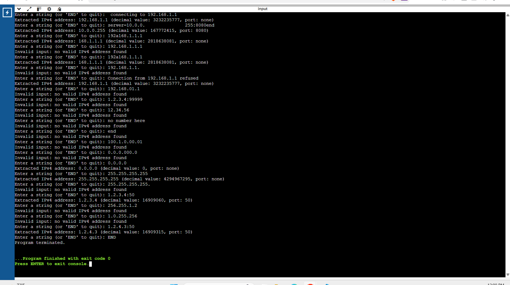
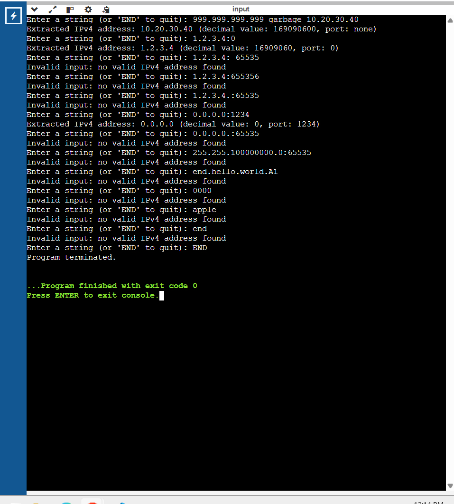

# A1 - IPv4 Extractor Test Cases
## Testing Overview

I tested the program using the sample inputs provided in the assignment and
additional test cases of my own.

The additional tests were designed to check:

- malformed IPv4 addresses
- leading zeros
- octet limits
- optional ports
- invalid ports
- full-candidate validation
- noisy text
- case-sensitive program termination

The program was run interactively and the observed results are documented below.

---

## Assignment Sample Tests

| Input | Expected Result | Actual Result | Status |
|---|---|---|---|
| `connecting to 192.168.1.1` | Extract `192.168.1.1`, port none | Extracted `192.168.1.1`, decimal value `3232235777`, port none | PASS |
| `server=10.0.0.255:8080end` | Extract `10.0.0.255`, port 8080 | Extracted `10.0.0.255`, decimal value `167772415`, port 8080 | PASS |
| `192a168.1.1.1` | Extract `168.1.1.1`, port none | Extracted `168.1.1.1`, decimal value `2818638081`, port none | PASS |
| `192.168.1.1.` | Invalid | `Invalid input: no valid IPv4 address found` | PASS |
| `Connection from 192.168.1.1 refused` | Extract `192.168.1.1`, port none | Extracted `192.168.1.1`, decimal value `3232235777`, port none | PASS |
| `192.168.01.1` | Invalid because of leading zero | `Invalid input: no valid IPv4 address found` | PASS |
| `1.2.3.4:99999` | Invalid port | `Invalid input: no valid IPv4 address found` | PASS |
| `12.34.56` | Invalid because it has too few octets | `Invalid input: no valid IPv4 address found` | PASS |
| `no number here` | Invalid | `Invalid input: no valid IPv4 address found` | PASS |

---

## Additional Student-Designed Tests

### Case-Sensitive END Test

| Input | Expected Result | Actual Result | Status |
|---|---|---|---|
| `end` | Program should continue because `END` is case-sensitive | Invalid IPv4 input; program continued | PASS |
| `END` | Program should terminate | Printed `Program terminated.` | PASS |

This verifies that only the exact uppercase text `END` terminates the program.

---

### Leading-Zero and Structure Tests

| Input | Expected Result | Actual Result | Status |
|---|---|---|---|
| `100.1.0.00.01` | Invalid because of malformed structure and leading zeros | Invalid | PASS |
| `0.0.0.000.0` | Invalid | Invalid | PASS |
| `0.0.0.0` | Valid | Extracted `0.0.0.0`, decimal value `0`, port none | PASS |

These tests confirm that a single zero is valid but multi-digit octets with
leading zeros are rejected.

---

### Octet Boundary and Full-Candidate Tests

| Input | Expected Result | Actual Result | Status |
|---|---|---|---|
| `255.255.255.255` | Valid maximum IPv4 address | Extracted `255.255.255.255`, decimal value `4294967295`, port none | PASS |
| `255.255.255.255.` | Invalid because the trailing period belongs to the candidate | Invalid | PASS |
| `256.255.1.2` | Invalid because an octet exceeds 255 | Invalid | PASS |
| `1.0.255.256` | Invalid because an octet exceeds 255 | Invalid | PASS |

The trailing-period test is important because the assignment requires the
complete candidate token to be validated rather than accepting a valid-looking
substring.

---

### Port Tests

| Input | Expected Result | Actual Result | Status |
|---|---|---|---|
| `1.2.3.4:50` | Valid address with port 50 | Extracted `1.2.3.4`, decimal value `16909060`, port 50 | PASS |
| `1.2.4.3:50` | Valid address with port 50 | Extracted `1.2.4.3`, decimal value `16909315`, port 50 | PASS |
| `1.2.3.4:0` | Valid address with port 0 | Extracted `1.2.3.4`, decimal value `16909060`, port 0 | PASS |
| `0.0.0.0:1234` | Valid address with port 1234 | Extracted `0.0.0.0`, decimal value `0`, port 1234 | PASS |

These tests verify that valid ports, including port 0, are accepted.

---

### Invalid Candidate Followed by Valid Candidate

| Input | Expected Result | Actual Result | Status |
|---|---|---|---|
| `999.999.999.999 garbage 10.20.30.40` | Reject first candidate and extract `10.20.30.40` | Extracted `10.20.30.40`, decimal value `169090600`, port none | PASS |

This verifies that the program can reject one malformed candidate and continue
searching the rest of the input for a valid address.

---

### personal Malformed Inputs

| Input | Expected Result | Actual Result | Status |
|---|---|---|---|
| `255.255.100000000.0:65535` | Invalid because an octet is too large | Invalid | PASS |
| `end.hello.world.A1` | Invalid | Invalid | PASS |
| `0000` | Invalid | Invalid | PASS |
| `apple` | Invalid | Invalid | PASS |

These cases test malformed numeric input and ordinary text containing no valid
IPv4 address.

---

## Requirements verified 

The test results shows the program can handel:
- Valid IPv4 addresses
- IPv4 addresses inside noisy text
- Exactly four octets
- Octet values from `0` through `255`
- Rejection of values greater than `255`
- Rejection of invalid leading zeros
- Optional port numbers
- Port value `0`
- Invalid port values
- Full-candidate validation
- Rejection of trailing punctuation
- Invalid candidates followed by later valid candidates
- Input containing no valid IPv4 address
- Case-sensitive `END` termination

---
# Test cases (image results)

